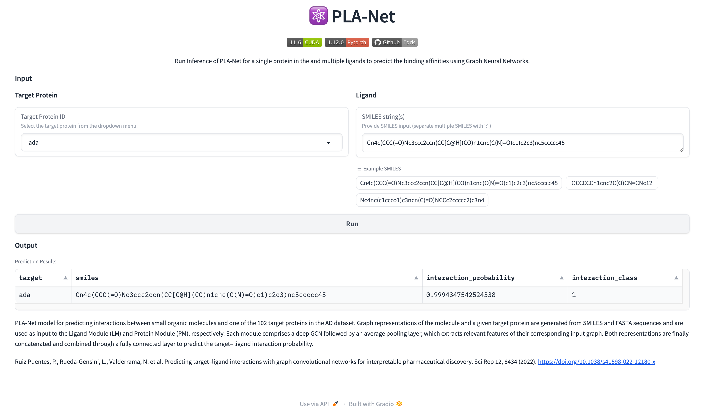

# PLA-Net: Predicting Protein-Ligand Interactions with Deep Graph Networks

Forked version of [PLA-Net](https://github.com/BCV-Uniandes/PLA-Net) 

[](https://huggingface.co/spaces/juliocesar-io/PLA-Net)


### [Original paper on Nature Scientific Reports](https://www.nature.com/articles/s41598-022-12180-x)

## Background

**PLA-Net** is a deep learning model designed to predict interactions between small organic molecules (ligands) and any of the 102 target proteins in the Alzheimer's Disease (AD) dataset. By transforming molecular and protein sequences into graph representations, PLA-Net leverages Graph Convolutional Networks (GCNs) to analyze and predict target-ligand interaction probabilities. Developed by [BCV-Uniandes](https://github.com/BCV-Uniandes/PLA-Net).

## Quick Start

If you want to run PLA-Net without installing it, you can run it freely on this [Hugging Face Space](https://huggingface.co/spaces/juliocesar-io/PLA-Net).



You can also use the provided notebook in the `notebooks` folder to run inference on the PLA-Net model with the gradio client. [](https://colab.research.google.com/drive/1HI_yfqxYKMl6CuF_61u-4PF615pKjyXF?usp=sharing)

## Key Features

- **Graph-Based Input Representation**
  - **Ligand Module (LM):** Converts SMILES sequences of molecules into graph representations.
  - **Protein Module (PM):** Transforms FASTA sequences of proteins into graph structures.

- **Deep Graph Convolutional Networks**
  - Each module employs a deep GCN followed by an average pooling layer to extract meaningful features from the input graphs.

- **Interaction Prediction**
  - The feature representations from the LM and PM are concatenated.
  - A fully connected layer processes the combined features to predict the interaction probability between the ligand and the target protein.

## Docker Install

To prevent conflicts with the host machine, it is recommended to run PLA-Net in a Docker container.

First make sure you have an NVIDIA GPU and [NVIDIA Container Toolkit](https://docs.nvidia.com/datacenter/cloud-native/container-toolkit/install-guide.html) installed. Then build the image with the following command:

```bash
docker build -t pla-net:latest .
```

### Inference

To run inference, run the following command:

```bash
docker run \
    -it --rm --gpus all \
    -v "$(pwd)":/home/user/output \
    pla-net:latest \
    python /home/user/app/scripts/pla_net_inference.py \
    --use_gpu \
    --target ada \
    --target_list /home/user/app/data/datasets/AD/Targets_Fasta.csv \
    --target_checkpoint_path /home/user/app/pretrained-models/BINARY_ada \
    --input_file_smiles /home/user/app/example/input_smiles.csv \
    --output_file /home/user/output/output_predictions.csv
```


This will run inference for the target protein `ada` with the SMILES in the `input_smiles.csv` file and save the predictions to the `output_predictions.csv` file.

The prediction file has the following format:

```bash
target,smiles,interaction_probability,interaction_class
ada,Cn4c(CCC(=O)Nc3ccc2ccn(CC[C@H](CO)n1cnc(C(N)=O)c1)c2c3)nc5ccccc45,0.9994347542524338,1
```

Where `interaction_class` is 1 if the interaction probability is greater than 0.5, and 0 otherwise.


*Inference Args:*

- `use_gpu`: Use GPU for inference.
- `target`: Target protein ID from the list of targets. Check the list of available targets in the [data](https://github.com/juliocesar-io/PLA-Net/blob/main/data/datasets/AD/Targets_Fasta.csv) folder.
- `target_list`: Path to the target list CSV file.
- `target_checkpoint_path`: Path to the target checkpoint. (e.g. `/workspace/pretrained-models/BINARY_ada`) one checkpoint for each target.
- `input_file_smiles`: Path to the input SMILES file.
- `output_file`: Path to the output predictions file.


### Gradio Server
We provide a simple graphical user interface to run PLA-Net with Gradio. To use it, run the following command:

```bash
docker run \
    -it --rm --gpus all \
    -p 7860:7860 \
    pla-net:latest \
    python app.py
```

Then open your browser and go to `http://localhost:7860/` to access the web interface. 

    
## Local Install

To do inference with PLA-Net, you need to install the dependencies and activate the environment. You can use conda or mamba to install the dependencies. mamba is recommended because it is faster.

```bash
mamba env create -f environment.yml
mamba activate pla_net
```

Now you can run inference with PLA-Net locally. In the project folder, run the following command:

```bash
python scripts/pla_net_inference.py \
    --use_gpu \
    --target ada \
    --target_list data/datasets/AD/Targets_Fasta.csv \
    --target_checkpoint_path pretrained-models/BINARY_ada \
    --input_file_smiles example/input_smiles.csv \
    --output_file example/output_predictions.csv
```

## Local Notebook Inside Docker Container

You can also run inference and training experiments with PLA-Net locally using a notebook. In the project folder, run the following command:

```bash
docker run \
    -it --rm --gpus all \
    -p 8888:8888 \
    -v "$(pwd)":/home/user/app \
    pla-net:latest \
    jupyter lab --ip 0.0.0.0 --port 8888 
```

Go to `http://0.0.0.0:8888/lab/tree/notebooks/PLA-Net-Local.ipynb`, you will be prompted to enter a token, you can get the token from the terminal where the command was run.

## Models

You can download the pre-trained models from the [Hugging Face Model Card](https://huggingface.co/juliocesar-io/PLA-Net/tree/main/checkpoints).

## Training 

To train each of the components of our method: LM, LM+Advs, LMPM and PLA-Net please refer to planet.sh file and run the desired models.

To evaluate each of the components of our method: LM, LM+Advs, LMPM and PLA-Net please run the corresponding bash file in the inference folder.

## Citation

Ruiz Puentes, P., Rueda-Gensini, L., Valderrama, N. et al. Predicting target–ligand interactions with graph convolutional networks for interpretable pharmaceutical discovery. Sci Rep 12, 8434 (2022). https://doi.org/10.1038/s41598-022-12180-x